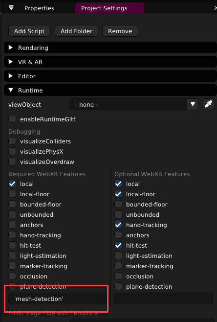
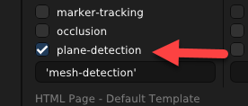
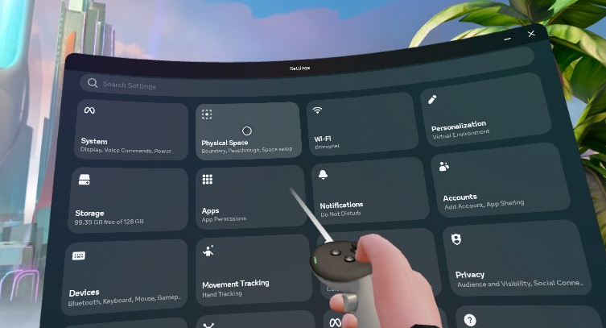
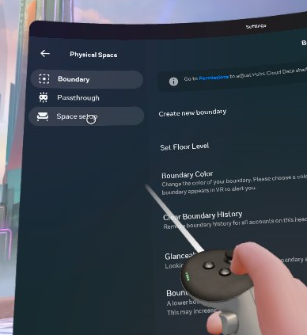
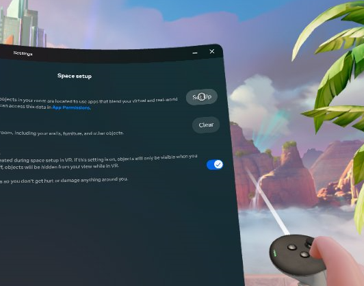
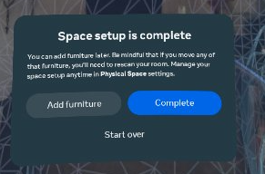

# Quest 3 - Mesh Detection Example 

## Components

This example contains 2 components.

### spatial-mesh.ts

The `spatial-mesh` reads the spatial mesh on Quest and displays it at runtime.

### random-plane-colors

Example of how to use the plane detection component. Sets the material of the plane to a random color. 

## Shaders

This example contains 2 shaders.

### invisible

The invisible shader renders nothing. This is helpful for the spatial mesh since also anything behind it is not visible. You can use this for occlusion of objects.

### shadowonly

The shadow only shader is similar to the invisible shader, but shows shadows. 

## Setup

- To use the spatial mesh, you need to request the `mesh-detection` feature. To do this, add `'mesh-detection'` (including quotes) to the Required WebXR features in the runtime category of the Project Settings. 
 

- To use plane detection, you need to check the `plane-detection` feature.

- Plane detection and spatial mesh are not _on_ by default. To get them you need to set them up in the quest. 
1. Go to the settings and select 'Physical Space'

2. Go to 'Space setup'

3. Select 'Set Up'

4. Follow the instructions, and walk around your room trying to get as much of the spatial mesh filled in as possible. This mesh will show up with the Mesh Detection. You might also want to add some furniture. The furniture will show up as planes when you do the Plane Detection. When you are done, hit 'Complete'.

